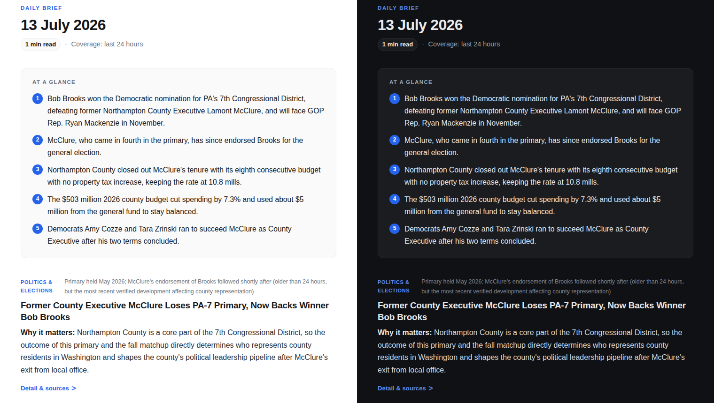

# Personal News Page Template

A zero-dependency GitHub Pages site that publishes a sourced daily news brief
on any topic you choose -- gated by a pull request you review and deployed
by GitHub Actions. No API key or paid service is needed; Claude can
optionally pre-fill each draft with sourced stories.

[](https://github.com/joseph-robert-f/personal-news-page-template/actions/workflows/build.yml)
[](https://github.com/joseph-robert-f/personal-news-page-template/actions/workflows/pr-checks.yml)

**Example instance:** [Northampton County, PA daily brief](https://joseph-robert-f.github.io/Northampton-County-News-/)
-- a real site built from this template.



## How it works

- **Plain static files.** The site is hand-written HTML, CSS, and a little
  JavaScript ([`index.html`](index.html), [`archive.html`](archive.html),
  [`assets/site.js`](assets/site.js)). No framework, no `package.json`, no
  build dependencies -- the scripts run on the Node that ships with GitHub's
  runners.
- **Each digest is one self-contained HTML file.** The manifest
  ([`scripts/build-manifest.mjs`](scripts/build-manifest.mjs)) reads each
  digest's date from its `<title>`, so there is no database; the Atom feed
  and sitemap ([`scripts/build-feed.mjs`](scripts/build-feed.mjs)) are built
  from that manifest at deploy time.
- **Drafts arrive as pull requests.** A scheduled workflow
  ([`daily-draft.yml`](.github/workflows/daily-draft.yml)) opens a draft PR
  every morning; merging it is what publishes. A DST-safe guard
  ([`scripts/should-run-now.mjs`](scripts/should-run-now.mjs)) fires at the
  right local time year-round and tolerates GitHub's late cron firings.
- **Claude writes the draft (optional).** With an API key set,
  [`scripts/generate-digest.mjs`](scripts/generate-digest.mjs) asks Claude to
  research the topic with web search and return structured, sourced stories.
  Output that fails validation or the content linter gets one retry with the
  errors fed back; after that the draft falls back to a placeholder -- it
  never publishes a broken page.
- **CI enforces the content rules.** [`pr-checks.yml`](.github/workflows/pr-checks.yml)
  validates the config, runs the tests, confirms the manifest is current, and
  lints changed digests against the Content Bar
  ([`scripts/check-digest.mjs`](scripts/check-digest.mjs)): five bullets max,
  a source on every story, no external assets.

## Engineering notes

- Built spec-first: [`docs/roadmap/`](docs/roadmap/) holds the review, the
  seven sprint specs, and each one's status -- a record of what was planned
  and what shipped.
- A [gate review](docs/roadmap/gate-review-results.md) tested the release
  adversarially, including sabotage PRs to prove each CI gate catches what it
  claims to. The [`test/`](test/) suite (`node --test`) covers the manifest,
  feed, scheduling, linter, and generation contract.
- [`docs/lessons-learned.md`](docs/lessons-learned.md) records what the first
  live runs broke that offline testing could not, and how each fix was
  pinned with a regression test.
- Developed spec-first with Claude (Claude Code) under human review; the
  sprint work merged through the same pull-request gate the site itself
  uses.

## What You Get

| File | Purpose |
| --- | --- |
| `site.config.json` | Your site title, topic, audience, timezone, cadence, color, and draft branch prefix. |
| `index.html` | Homepage that frames the newest published digest. Supports `?date=YYYY-MM-DD`. |
| `archive.html` | Archive grouped by month, newest first. |
| `templates/digest-template.html` | Starter HTML used by the draft generator. |
| `scripts/new-digest.mjs` | Creates a dated draft digest from the template. |
| `scripts/build-manifest.mjs` | Scans dated digest files and writes `digests.json`. |
| `scripts/build-feed.mjs` | Generates `feed.xml` (Atom) and `sitemap.xml` from `digests.json`; the site URL is derived from the repository name on Actions. |
| `scripts/check-digest.mjs` | Lints a digest against the Content Bar. |
| `scripts/should-run-now.mjs` | Schedule guard: decides which daily firing creates the draft. |
| `scripts/check-cron.mjs` | Confirms the workflow cron lines cover your configured publish time. |
| `scripts/generate-digest.mjs` | Optional AI draft generation (needs `ANTHROPIC_API_KEY`). |
| `scripts/check-freshness.mjs` | Auto mode: reports days since the last digest, for the failure alert. |
| `.github/workflows/daily-draft.yml` | Scheduled Action that opens draft PRs for review. |
| `.github/workflows/build.yml` | Deploys the published site to GitHub Pages on pushes to `main`. |
| `.github/workflows/pr-checks.yml` | Runs the config check, tests, manifest check, and digest linter on every PR. |

## Setup

Three steps get a working site:

1. Click **Use this template** to create your repository.
2. Enable GitHub Pages: **Settings -> Pages -> Build and deployment ->
   Source: GitHub Actions** (and approve Actions if your fork asks).
3. Let the daily workflow open PRs: **Settings -> Actions -> General ->
   Workflow permissions -> check "Allow GitHub Actions to create and approve
   pull requests"**. GitHub disables this by default in new repositories;
   without it, the daily draft branch is pushed but the PR creation step
   fails with "GitHub Actions is not permitted to create or approve pull
   requests".

That's it -- the site deploys, and the daily workflow starts opening draft
PRs on schedule. No API key is needed: each draft is a placeholder that you
fill in, then merge. Everything below is optional.

**Optional add-on -- have Claude write the drafts:** add one repository
secret named `ANTHROPIC_API_KEY` (**Settings -> Secrets and variables ->
Actions**) with an API key from
[console.anthropic.com](https://console.anthropic.com/). The secret is the
switch -- with it set, each daily draft arrives pre-filled with sourced
stories for you to review; without it, nothing changes. This is a paid API
(roughly $0.50-$2.00 per daily draft); see [AI Drafts](#ai-drafts-optional)
before you turn it on.

**Make it yours** by editing `site.config.json` (a plain JSON file; every key
is optional and has a sensible default):

- `topic` / `audience`: what the brief tracks and who it's for. They fill in
  the placeholder draft and the digest footer and, if you use AI drafts,
  steer everything Claude writes.
- `siteTitle`, `digestTitlePrefix`, `eyebrow`: naming and branding.
- `timezone` and `publishTimeLocal`: when the daily draft is created. If you
  move these far from the default (06:30 US Eastern), CI will tell you the
  two cron lines to paste into the workflow -- see Daily Routine.
- `description`: one-line site description (used in the feed and meta tags).
- `coverageWindow`: the period each digest covers (default "last 24 hours");
  shown on digests and used to steer AI drafts.
- `accentColor`: CSS color for links and badges. The site supports light and
  dark mode; check a custom accent against both backgrounds.
- `siteUrl`: leave empty on a normal GitHub Pages deployment -- the Atom feed
  and sitemap URLs are derived automatically from your repository name. Set
  it only for a custom domain.

## Daily Routine

> **Note for this template repository:** the daily schedule is dormant on the
> template itself (it would only produce placeholder PRs). In a repository
> created from the template, the schedule runs automatically -- each copy's
> workflow is fully independent and uses that repository's own Actions quota
> and secrets.


By default the scheduled workflow does not publish automatically (see
[Auto-publish](#auto-publish-optional-hands-off-mode) for the opt-in
exception). It creates a branch like
`daily-digest/2026-07-04`, writes a draft digest file, rebuilds `digests.json`,
and opens a draft pull request.

Review the PR, replace the placeholder text with your brief, add source links,
and merge it into `main`. The Pages workflow then publishes the digest.

GitHub cron schedules run in UTC, but `timezone`/`publishTimeLocal` is a local
wall-clock time whose UTC offset changes with daylight saving time. Instead of
requiring a manual cron edit whenever you change either setting,
`.github/workflows/daily-draft.yml` fires twice a day -- once for each
possible UTC offset of the configured local time -- and a guard step
(`scripts/should-run-now.mjs`) checks the current wall-clock time in
`config.timezone` against `publishTimeLocal` to decide which firing creates
the draft. The window accepts a firing up to 35 minutes early or 4 hours
late, because GitHub often delays scheduled runs by an hour or more. When
both firings land inside the window, the second one finds today's draft
already on the branch and does nothing.
`workflow_dispatch` runs always pass `--force` to bypass the time gate.

If you change `timezone` or `publishTimeLocal` far enough that the two cron
lines no longer bracket it, `node scripts/check-cron.mjs` (run automatically
in PR CI) fails and prints the exact cron lines to paste into
`.github/workflows/daily-draft.yml`.

## AI Drafts (optional)

By default the daily workflow writes a placeholder draft for you to fill in. You
can optionally have it pre-fill the draft with real, sourced content generated
by Claude with web search. Nothing changes about the publishing rule: the AI
writes the draft, a human still reviews and merges the PR.

To enable it, add **one repository secret**: create an Anthropic API key and
save it as an Actions secret named `ANTHROPIC_API_KEY` (Settings -> Secrets
and variables -> Actions -> New repository secret). The secret is the switch:
with it set, AI drafts are on; without it, the workflow writes placeholder
drafts exactly as before. No config change is needed.

The optional `ai` object in `site.config.json` tunes the behavior (all keys
optional; defaults shown):

| Key | Default | Meaning |
| --- | --- | --- |
| `ai.enabled` | `true` | Set to `false` to pause AI drafts without deleting the secret. |
| `ai.model` | `"claude-sonnet-5"` | Model used for generation. Set to `"claude-opus-4-8"` for maximum quality at higher cost. |
| `ai.maxStories` | `4` | Maximum number of story cards (1-8). |
| `ai.effort` | `"medium"` | Thinking depth: `"low"`, `"medium"`, or `"high"`. The dominant cost lever -- see Cost below. |
| `ai.instructions` | `""` | Free-text steering appended to the prompt, e.g. `"Skip celebrity news; prefer primary sources."` |

A partial override such as `"ai": { "enabled": true }` keeps the other defaults.

**Cost:** budget **roughly $0.50-$2.00 per daily generation** on Sonnet 5 --
measured from real runs, not the per-token sticker price. The searches
themselves are cheap (about a cent each); the real cost is that every
search's results are re-processed as input tokens on each iteration of the
model's research loop, plus adaptive-thinking tokens billed at output rates
throughout. The template defaults are tuned for this (`ai.effort: "medium"`,
6 web searches); expect the low end of that range with them, and reduce
further with `ai.effort: "low"` and a smaller `ai.maxStories`. `"high"`
effort or Opus-class models can multiply the cost. Two more things that
protect your balance: failed or aborted generations still bill for the work
the API already did (the retry logic is deliberately conservative -- one
retry per failure class), and it is worth setting a spend alert in the
Anthropic Console so an empty balance never silently stops your mornings.

**Review obligation:** generated drafts can misattribute or hallucinate sources.
The draft PR includes a checklist item to **verify every AI-cited source link
actually supports the claim** before merging. Do not merge an AI draft
unreviewed.

If generation fails for any reason (missing key, API error, model refusal, or
the output failing `check-digest.mjs` after a retry), the workflow logs a
warning and falls back to the placeholder draft — the daily PR always opens.

### Auto-publish (optional, hands-off mode)

If you don't want to merge a PR every day, set one key in `site.config.json`:

```json
"publishMode": "auto"
```

In auto mode the daily workflow generates the digest and, **only if
generation fully succeeds** — schema-valid payload, every story sourced, and
a clean pass through the content linter — commits it straight to `main`,
which deploys it. There is no PR and no human step.

Auto mode needs the `ANTHROPIC_API_KEY` secret and API credit. Without
them there is nothing to publish -- use review mode if you don't want a paid
API in the loop.

**Failure alert:** a failed generation keeps the run green, so auto mode
watches for a streak instead. When the site has gone two days without a new
digest, the workflow opens one issue titled *Daily digest: auto-publish is
failing* with the cause and a link to the run, adds a comment for each
further failed day, and closes the issue after the next successful publish.
Watch the repository (or at least its issues) to get the notification. One
thing the alert cannot catch: GitHub disables scheduled workflows in public
repositories after 60 days without activity. An auto-mode site that
publishes daily never hits this, but if yours has stopped for a while,
check the Actions tab for a "disabled" banner.

What you give up is source verification: nobody confirms the cited links
actually support the claims before they publish. The automated gates still
stand (structure validation, HTML escaping, `javascript:`/`data:` URLs
dropped, sourceless stories dropped, linter must pass), and a failed
generation publishes **nothing** — the placeholder never goes live in auto
mode; a delayed scheduled firing the same morning retries automatically.

`"publishMode": "review"` (the default) restores the PR gate at any time.
A sensible middle path: run in review mode for the first week or two while
you calibrate `ai.instructions`, then switch to auto once you trust the
output — and spot-check the site now and then.

## Local Commands

Validate your config:

```bash
node scripts/validate-config.mjs
```

Create a draft for today:

```bash
node scripts/new-digest.mjs
```

Create a draft for a specific date:

```bash
node scripts/new-digest.mjs --date 2026-07-04
```

Preview where a draft would be written:

```bash
node scripts/new-digest.mjs --date 2026-07-04 --dry-run
```

Rebuild the manifest:

```bash
node scripts/build-manifest.mjs
```

Generate the Atom feed and sitemap. On GitHub Actions the site URL is
derived from the repository name; locally, set `siteUrl` in
`site.config.json` or `GITHUB_REPOSITORY=owner/repo`, otherwise it prints a
notice and exits without writing anything:

```bash
node scripts/build-feed.mjs
```

Run the unit tests:

```bash
node --test
```

Lint a digest against the Content Bar (bullet count, source links, self-contained assets, etc.):

```bash
node scripts/check-digest.mjs path/to/digest.html
```

Preview the exact request that the AI draft generator would send (requires
`ANTHROPIC_API_KEY`; makes no API call):

```bash
node scripts/generate-digest.mjs --date 2026-07-04 --dry-run
```

## Content Format

Each digest is a self-contained HTML file under:

```text
YEAR/Month/Week range/D Month Personal News Digest.html
```

The manifest reads the date from the digest `<title>` using `D Month YYYY`.
The archive preview comes from `<meta name="description">`. Keep both accurate
before merging a daily PR.

The starter template is designed for a quick skim:

- Up to five "At a glance" bullets.
- A small set of story cards.
- One clear "Why it matters" line per story.
- Source links inside each story's details block.
